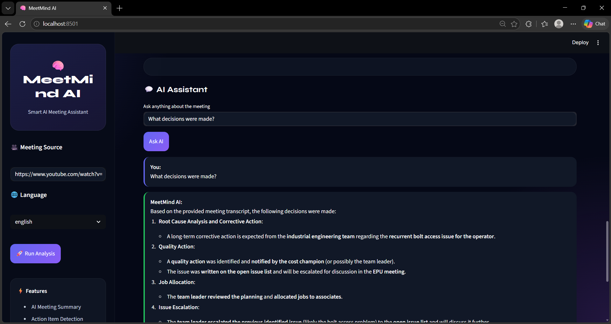
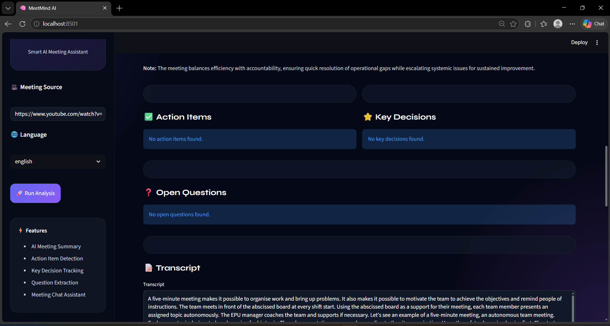

<div align="center">

# 🧠 MeetMind AI
### AI-Powered Meeting Intelligence Assistant

<br/>

[](https://www.python.org/)
[](https://fastapi.tiangolo.com/)
[](https://langchain.com/)
[](https://mistral.ai/)
[](https://openai.com/research/whisper)
[](https://www.trychroma.com/)

<br/>

> **Transform meeting recordings into structured, searchable, and conversational intelligence — instantly.**

</div>

---

## 📸 Screenshots

<div align="center">
  
  <br/><br/>
  
  <br/><br/>
  
</div>

---

## 📋 Table of Contents

- [Overview](#-overview)
- [Features](#-features)
- [System Architecture](#-system-architecture)
- [AI Workflow](#-ai-workflow)
- [Tech Stack](#-tech-stack)
- [Project Structure](#-project-structure)
- [Installation](#-installation)
- [API Reference](#-api-reference)
- [Environment Variables](#-environment-variables)
- [Future Roadmap](#-future-roadmap)
- [Author](#-author)

---

## 🔍 Overview

**MeetMind AI** is a full-stack AI application that converts meeting recordings — from YouTube URLs or local video/audio files — into structured, actionable intelligence. It combines state-of-the-art speech recognition, large language models, and Retrieval-Augmented Generation (RAG) to give teams instant access to every insight from their meetings.

Whether it's a 2-hour sprint retrospective or a 15-minute standup, MeetMind AI processes, understands, and makes it queryable in seconds.

---

## ✨ Features

| Feature | Description |
|---|---|
| 🎤 **AI Transcription** | Supports English and Hinglish via Whisper & Sarvam AI |
| 📝 **Meeting Summary** | Executive-level bullet-point summaries using map-reduce LLM chains |
| ✅ **Action Item Extraction** | Identifies tasks, owners, and deadlines automatically |
| ⭐ **Key Decision Tracking** | Extracts critical decisions discussed in the meeting |
| ❓ **Open Question Detection** | Surfaces unresolved topics and follow-up items |
| 💬 **Conversational AI Chat** | Ask anything about your meeting using RAG-powered Q&A |
| 🔎 **Semantic Search** | Vector embedding search over full transcript using ChromaDB |
| 🌐 **YouTube Support** | Directly paste a YouTube meeting link — no manual download needed |

---

## 🏗️ System Architecture

```
YouTube URL / Local File (video or audio)
                │
                ▼
    ┌───────────────────────┐
    │    Audio Processor    │  ← yt-dlp + pydub + FFmpeg
    │  Download → WAV → Chunk│
    └───────────┬───────────┘
                │
                ▼
    ┌───────────────────────┐
    │   Speech-to-Text STT  │
    │  ┌────────┬─────────┐ │
    │  │Whisper │Sarvam AI│ │  ← English / Hinglish routing
    │  └────────┴─────────┘ │
    └───────────┬───────────┘
                │
                ▼
    ┌───────────────────────┐
    │  Transcript (raw text)│
    └───────────┬───────────┘
                │
         ┌──────┴──────┐
         ▼             ▼
  ┌─────────────┐  ┌──────────────────────┐
  │  Summarizer │  │  Intelligence Extractor│
  │ (Map-Reduce)│  │ Action Items / Decisions│
  └─────────────┘  │ Open Questions         │
                   └──────────────────────┘
                │
                ▼
    ┌───────────────────────┐
    │  Embeddings + ChromaDB│  ← all-MiniLM-L6-v2
    └───────────┬───────────┘
                │
                ▼
    ┌───────────────────────┐
    │  RAG Pipeline (LCEL)  │  ← Retriever + Mistral AI
    │  Conversational Chat  │
    └───────────────────────┘
```

---

## ⚡ AI Workflow

### Step 1 — Audio Processing
- Accepts a **YouTube URL** or a **local file path** (video/audio)
- Downloads or converts input to **mono WAV at 16kHz** — optimized for speech models
- Splits audio into **10-minute chunks** to handle long meetings and respect API limits

### Step 2 — Speech-to-Text Transcription
| Engine | Use Case |
|---|---|
| **OpenAI Whisper** (`small` model) | English meetings — runs locally |
| **Sarvam AI** (`saaras:v2.5`) | Hinglish meetings — translates to English while transcribing |

For Sarvam AI, audio chunks are further split into **25-second sub-pieces** to comply with API limits.

### Step 3 — AI Summarization (Map-Reduce)
1. Transcript is split into overlapping **3000-token chunks**
2. Each chunk is summarized independently (map phase)
3. Partial summaries are combined into a **final executive summary** (reduce phase)
4. This approach overcomes LLM context window limits for long meetings

### Step 4 — Intelligence Extraction
Three parallel LangChain chains extract:
- **Action Items** — task description, responsible owner, deadline
- **Key Decisions** — important choices made during the meeting
- **Open Questions** — unresolved topics requiring follow-up

### Step 5 — RAG-Powered Chat
1. Transcript is chunked into **500-token segments** and embedded using `all-MiniLM-L6-v2`
2. Embeddings are stored in a **local ChromaDB vector store**
3. On each user query, the **top-4 semantically similar chunks** are retrieved
4. Retrieved context is injected into Mistral AI's prompt for a **grounded, hallucination-resistant response**

---

## 🛠️ Tech Stack

### Frontend
- **HTML5** — structure
- **CSS3** — custom styling with CSS variables and dark theme
- **Vanilla JavaScript** — API calls, dynamic rendering

### Backend
- **FastAPI** — REST API with CORS support
- **Python 3.11** — core runtime
- **python-dotenv** — environment variable management
- **uvicorn** — ASGI server

### AI & NLP
- **LangChain** — LLM orchestration, LCEL chains, text splitting
- **Mistral AI** (`mistral-tiny`) — summarization, extraction, RAG Q&A
- **OpenAI Whisper** — English speech-to-text
- **Sarvam AI** — Hinglish speech-to-text with translation
- **HuggingFace Sentence Transformers** (`all-MiniLM-L6-v2`) — text embeddings

### Vector Database
- **ChromaDB** — local persistent vector store for semantic search

### Audio Processing
- **yt-dlp** — YouTube audio download
- **pydub** — audio format conversion and chunking
- **FFmpeg** — low-level media processing

---

## 📂 Project Structure

```
ai-meeting-intelligence-assistant/
│
├── frontend/                    # Static web UI
│   ├── index.html               # Main application page
│   ├── style.css                # Dark-themed custom styles
│   └── app.js                   # Frontend logic & API integration
│
├── backend/
│   └── api.py                   # FastAPI app — /analyze and /chat endpoints
│
├── core/                        # AI pipeline modules
│   ├── transcriber.py           # Whisper + Sarvam AI transcription routing
│   ├── summarizer.py            # Map-reduce summarization chain
│   ├── extractor.py             # Action items, decisions, questions extraction
│   ├── rag_engine.py            # RAG pipeline (LCEL) with Mistral AI
│   └── vector_store.py          # ChromaDB vector store builder & retriever
│
├── utils/
│   └── audio_processor.py       # YouTube download, WAV conversion, chunking
│
├── screenshots/                 # Demo screenshots
├── requirements.txt             # Python dependencies
├── runtime.txt                  # Python version specification
├── .gitignore
└── README.md
```

---

## ⚙️ Installation

### Prerequisites

Make sure you have the following installed:
- Python 3.11+
- FFmpeg ([install guide](https://ffmpeg.org/download.html))
- pip

---

### 1. Clone the Repository

```bash
git clone https://github.com/sumitghugare/ai-meeting-intelligence-assistant.git
cd ai-meeting-intelligence-assistant
```

### 2. Create a Virtual Environment

```bash
python -m venv venv
```

**Windows:**
```bash
venv\Scripts\activate
```

**Linux / macOS:**
```bash
source venv/bin/activate
```

### 3. Install Dependencies

```bash
pip install -r requirements.txt
```

> ⚠️ First run will download the Whisper `small` model and `all-MiniLM-L6-v2` embeddings automatically.

### 4. Configure Environment Variables

Create a `.env` file in the root directory:

```env
# Required
MISTRAL_API_KEY=your_mistral_api_key_here

# Required only for Hinglish transcription
SARVAM_API_KEY=your_sarvam_api_key_here

# Optional — defaults to "small"
WHISPER_MODEL=small

# Optional — defaults to "saaras:v2.5"
SARVAM_STT_MODEL=saaras:v2.5
```

### 5. Start the Backend

```bash
uvicorn backend.api:app --reload
```

The API will be available at `http://127.0.0.1:8000`

### 6. Open the Frontend

Open `frontend/index.html` in your browser using **VS Code Live Server** or any local HTTP server.

---

## 📡 API Reference

### `POST /analyze`

Processes a meeting recording and returns all extracted intelligence.

**Request Body:**
```json
{
  "source": "https://youtube.com/watch?v=..." ,
  "language": "english"
}
```

| Field | Type | Options | Description |
|---|---|---|---|
| `source` | `string` | URL or file path | YouTube link or local file path |
| `language` | `string` | `english`, `hinglish` | Selects transcription engine |

**Response:**
```json
{
  "success": true,
  "title": "Q3 Product Review Meeting",
  "summary": "• Discussed Q3 roadmap...\n• Agreed on release date...",
  "transcript": "Full raw transcript text...",
  "action_items": ["1. John to update the spec by Friday", "..."],
  "key_decisions": ["1. Approved the new design system", "..."],
  "questions": ["1. Who owns the API migration?", "..."]
}
```

---

### `POST /chat`

Ask a natural language question about the analyzed meeting.

> ⚠️ Requires `/analyze` to be called first in the same session.

**Request Body:**
```json
{
  "question": "Who is responsible for the database migration?"
}
```

**Response:**
```json
{
  "answer": "Based on the transcript, Sarah was assigned the database migration task..."
}
```

---

## 🔐 Environment Variables

| Variable | Required | Default | Description |
|---|---|---|---|
| `MISTRAL_API_KEY` | ✅ Yes | — | API key from [Mistral AI](https://console.mistral.ai/) |
| `SARVAM_API_KEY` | ⚠️ Hinglish only | — | API key from [Sarvam AI](https://www.sarvam.ai/) |
| `WHISPER_MODEL` | ❌ No | `small` | Whisper model size: `tiny`, `base`, `small`, `medium`, `large` |
| `SARVAM_STT_MODEL` | ❌ No | `saaras:v2.5` | Sarvam STT model version |

---

## 🚀 Future Roadmap

- [ ] 🎙️ **Speaker Diarization** — identify and label individual speakers
- [ ] ⏱️ **Timestamp-based Retrieval** — jump to exact meeting moments
- [ ] 📄 **PDF Export** — download meeting reports as formatted PDFs
- [ ] ⚛️ **React Frontend** — modern component-based UI
- [ ] ☁️ **Cloud Deployment** — Docker + AWS/GCP support
- [ ] 📊 **Analytics Dashboard** — meeting trends and team productivity metrics
- [ ] ⚡ **Real-time Transcription** — live meeting capture via microphone
- [ ] 🗓️ **Calendar Integration** — auto-sync with Google Meet / Zoom / Teams

---

## 📚 Learning Outcomes

This project provides hands-on experience with:

- **Retrieval-Augmented Generation (RAG)** — grounded AI responses from domain-specific documents
- **LangChain LCEL** — composable LLM pipeline orchestration
- **Vector Databases** — semantic search with ChromaDB and sentence embeddings
- **Speech AI** — integrating Whisper and multilingual STT APIs
- **Prompt Engineering** — structured extraction with zero-shot LLM prompting
- **FastAPI** — async REST APIs with Pydantic validation
- **AI System Design** — architecting a multi-stage AI pipeline

---

## 👨‍💻 Author

**Sumit Shivaji Ghugare**
AI/ML Engineer · Generative AI Enthusiast

[](https://github.com/sumitghugare)

---

<div align="center">

⭐ **If this project helped you, please give it a star on GitHub!** ⭐

</div>
